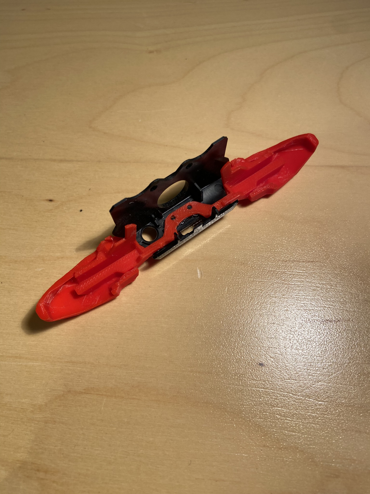
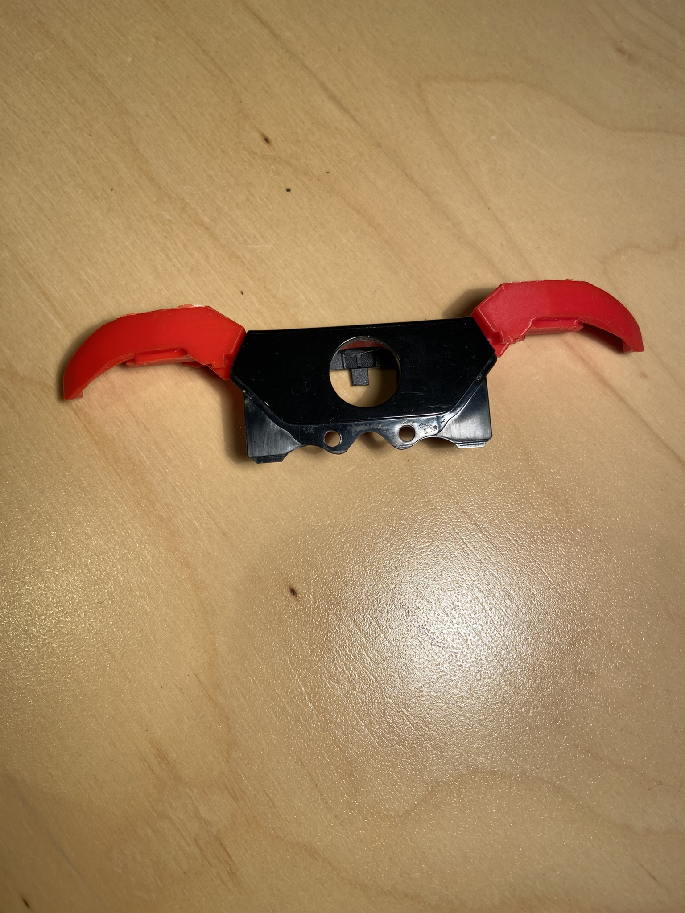
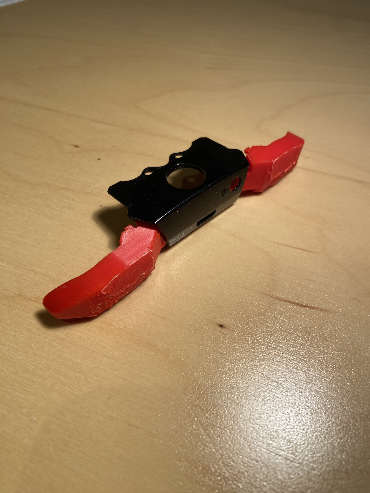
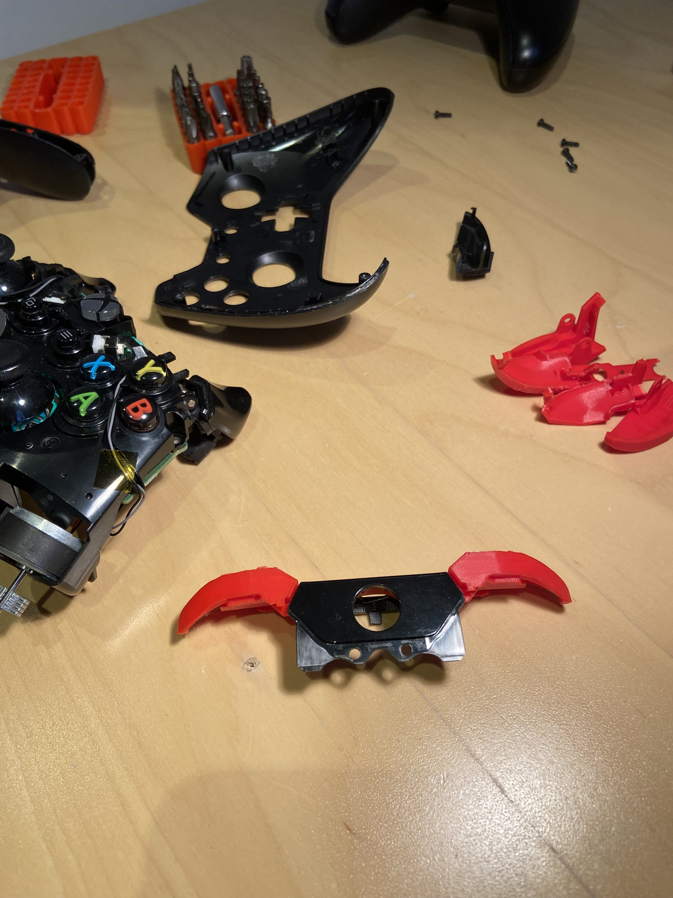
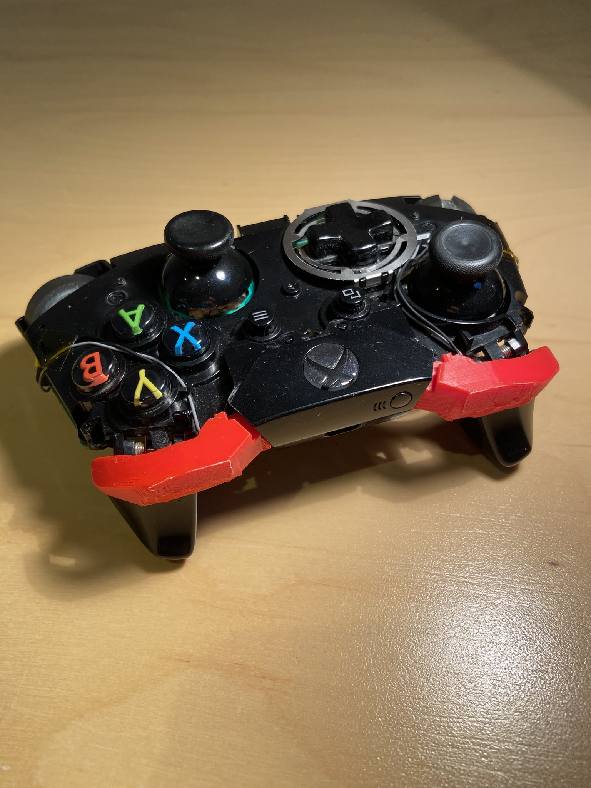
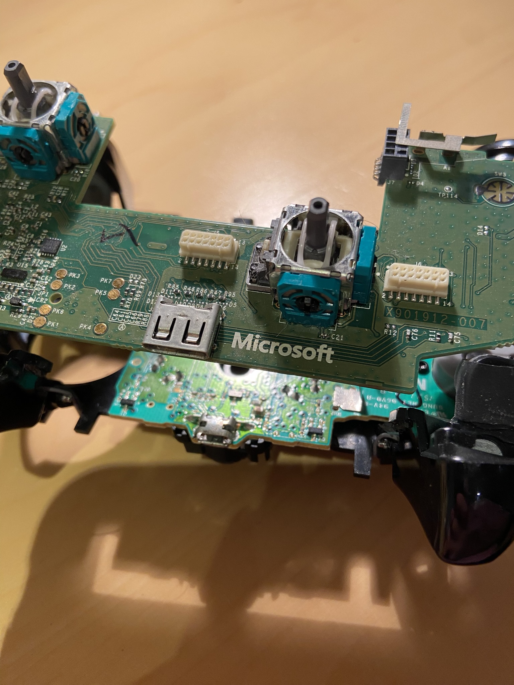
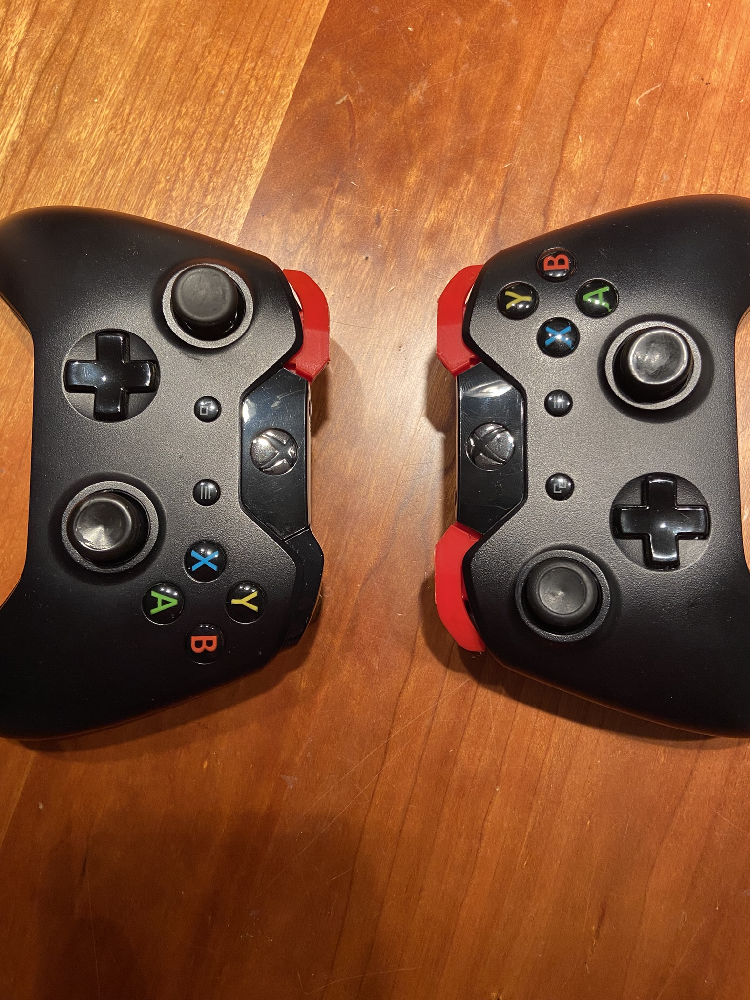

# Xbox One Controller — 3D Printable Replacement Parts

Custom-designed 3D printable replacement parts for the **Xbox One Controller**. All parts were modeled in SolidWorks and are provided as both source (`.SLDPRT`) and ready-to-print (`.STL`) files.

Feel free to download, print, and modify these parts for your own use!

---

## Photos

  
  

  
  

  
  

  

---

## Parts Included

| File | Description |
|------|-------------|
| `LB.stl` | Left Bumper (LB) — ready to print |
| `RB.stl` | Right Bumper (RB) — ready to print |
| `Whole Bumper.stl` | Full bumper assembly — ready to print |
| `LB Button.SLDPRT` | LB Button — SolidWorks source file |
| `Home Button Cover.SLDPRT` | Home / Xbox button cover — SolidWorks source file |

---

## Printing Guidelines

- **Material:** PLA or PETG recommended
- **Layer Height:** 0.1–0.2 mm for best fit and finish
- **Infill:** 80–100% for structural strength
- **Supports:** May be needed depending on orientation — check each part

---

## How to Use

1. Download the `.stl` file(s) you need.
2. Open in your preferred slicer (Cura, PrusaSlicer, etc.).
3. Slice with the recommended settings above and print.
4. Test fit and install on your Xbox One controller.

---

## Editing the Source Files

The `.SLDPRT` files can be opened and modified in **SolidWorks**. Feel free to adapt the designs to your needs.

---

## License

This project is licensed under the [MIT License](LICENSE) — you are free to use, modify, and distribute these files.

---

## Contributing

Found an improvement or want to add a new part? Pull requests and issues are welcome!

---

*Designed and shared by [dan-nehushtan](https://github.com/dan-nehushtan)*